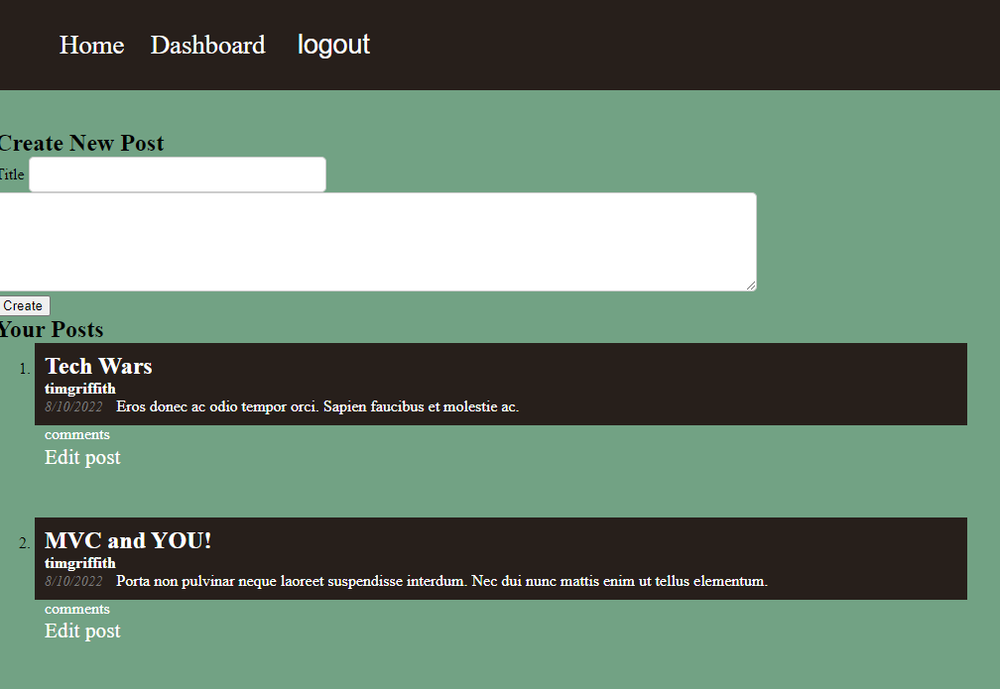
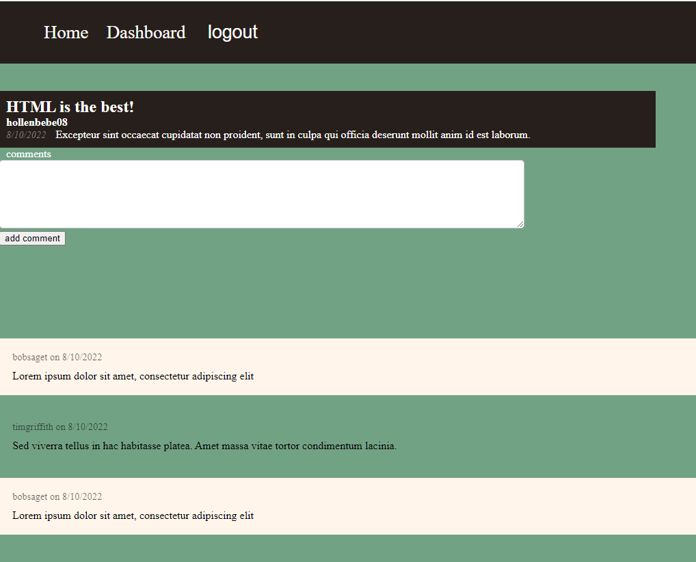

# Tech Blog

## Description 
The Tech Blog website is a CMS based website that allows developers to post various helpful blogs about development. They are also able to comment on other individuals blogs and have their own dashboard once logged in. 

## Installation Instructions 
To use the Tech Blog navigate to https://quiet-wave-42003.herokuapp.com/. Login to start making posts. 

## Usage Instructions 
Any individual is free to use the Tech Blog. Please note that the Tech Blog is deployed using Heroku and is part of a bootcamp class assignment. It is not an official website and will not be maintained. 

## Contribution Instructions 
If you are wanting to contribute to this project, please reach out to me via the contact information below for permission to do so.

## Test Instructions 
Currently tnot tests are being done on the Tech Blog. If you are wanting to perform tests please reach out to me via my contact information below.

## Contact Information 
* betsy.griffith12@gmail.com
* If you have any questions please send them to me via the email address provided.
* [GitHub Profile](https://github.com/hollenbebe08)

## Link to the Tech Blog
https://quiet-wave-42003.herokuapp.com/

## Deployed Site Screenshot:

# Main Page - Prior to Login

# Main Page - After Login

# Dashboard

# Login Page

# Single-Post Page

